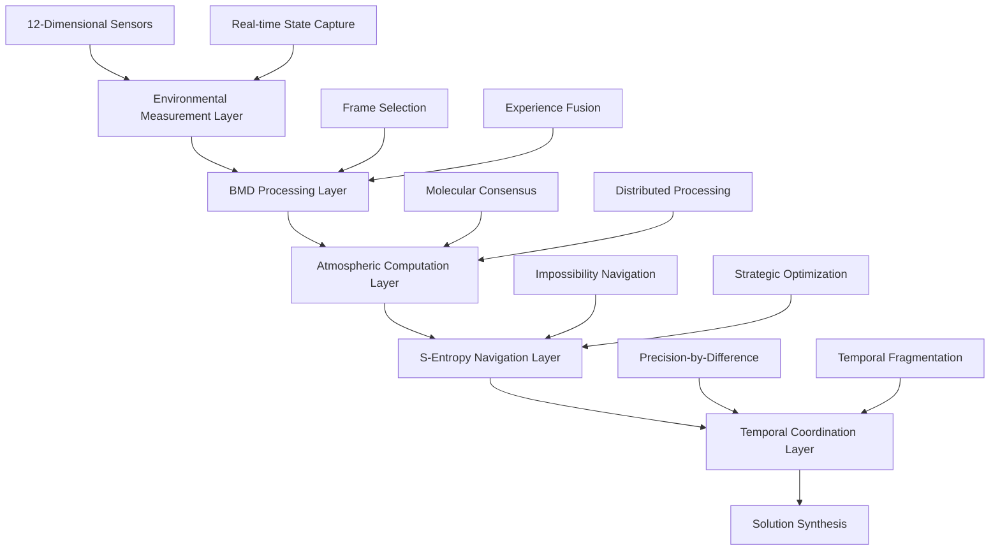
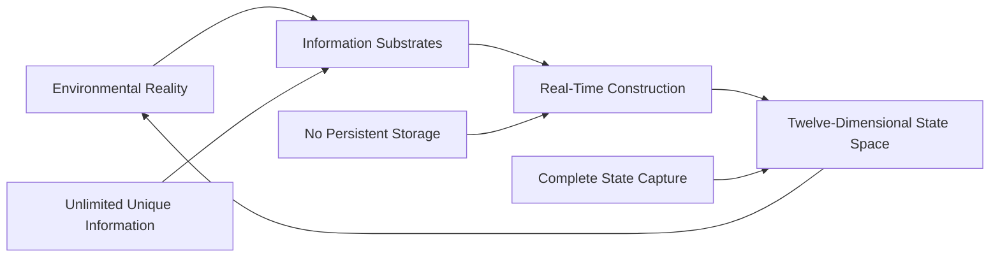
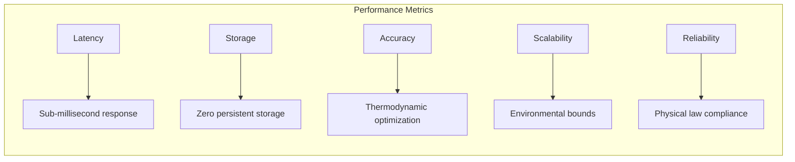
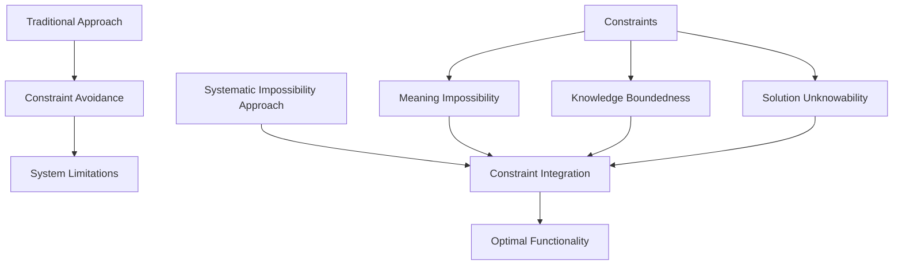

# Graffiti Search: A Proof-Based Information Retrieval System

An information retrieval system that constructs mathematical proofs from environmental state measurements using distributed atmospheric processing, temporal coordination mechanisms, and impossibility-based optimization techniques.

## System Characteristics

The system exhibits the following operational properties:

- **Environmental Construction**: Information synthesis from real-time environmental measurements without pre-stored data
- **Distributed Atmospheric Processing**: Utilization of atmospheric molecular networks for computational tasks
- **Temporal Coordination**: Sub-millisecond response times through differential timing mechanisms
- **Twelve-Dimensional Measurement**: Environmental state capture across biometric, spatial, atmospheric, and quantum dimensions
- **Impossibility Optimization**: Navigation of solution spaces through strategic constraint manipulation
- **Universal Solvability**: Theoretical guarantee of solution existence for well-formed queries

## System Architecture

### Environmental State Processing

The system operates through four primary computational layers:



#### Environmental Measurement Subsystem
- **Dimensional Coverage**: Simultaneous measurement across biometric, spatial, atmospheric, cosmic, temporal, hydrodynamic, geological, quantum, computational, acoustic, ultrasonic, and visual dimensions
- **State Construction**: Real-time synthesis of environmental conditions without persistent storage
- **Uniqueness Calculation**: Environmental state uniqueness factor computation for proof differentiation

#### Atmospheric Processing Network
- **Molecular Distribution**: Approximately 10^44 atmospheric molecules utilized as distributed computational elements
- **Task Allocation**: N₂ molecules process logical structures, O₂ molecules validate evidence chains
- **Consensus Mechanisms**: Network-wide agreement protocols for proof verification
- **Quantum Timing**: Molecular oscillation patterns provide temporal synchronization references

#### Temporal Coordination Framework
- **Differential Timing**: Precision enhancement through coordinate differential measurements
- **Preemptive Processing**: Query processing initiation before completion of user input
- **Latency Minimization**: Response delivery optimization through temporal fragmentation

#### S-Entropy Optimization System
- **Tri-dimensional Navigation**: Movement through S_knowledge, S_time, S_entropy coordinate space
- **Impossibility Handling**: Strategic combination of locally impossible solution approaches
- **Constraint Resolution**: Mathematical elimination of infinite terms through weight alternation

## Installation and Configuration

### System Requirements

- Rust toolchain version 1.75 or later with WebAssembly target support
- Node.js runtime version 18 or later for web development components
- Docker containerization platform (optional)

### Installation Procedure

```bash
# Repository acquisition
git clone https://github.com/fullscreen-triangle/graffiti.git
cd graffiti

# WebAssembly target installation
rustup target add wasm32-unknown-unknown

# wasm-pack installation for WebAssembly packaging
curl https://rustwasm.github.io/wasm-pack/installer/init.sh -sSf | sh

# Project compilation
make build

# Test suite execution
make test

# Development server initialization
make dev
```

### WebAssembly Compilation

```bash
# WebAssembly compilation
make wasm

# Production-optimized WASM compilation
make wasm-release

# Local server deployment
make serve
```

## System Component Architecture

The following diagram illustrates the complete computational pipeline from environmental measurement to solution delivery:

```mermaid
graph TB
    subgraph ENV ["Environmental Reality Layer"]
        B1[Biometric] & B2[Spatial] & B3[Atmospheric] & B4[Quantum]
        B5[Temporal] & B6[Hydrodynamic] & B7[Geological] & B8[Computational]  
        B9[Acoustic] & B10[Ultrasonic] & B11[Visual] & B12[Cosmic]
    end
    
    subgraph BMD ["BMD Query Processing Layer"]
        C1[Experience Processing] --> C2[Frame Selection]
        C2 --> C3[Fusion Engine] --> C4[Sanity Validation]
    end
    
    subgraph ATM ["Atmospheric Molecular Processing Layer"]
        D1[N₂ Logic Verification] & D2[O₂ Evidence Validation]
        D3[H₂O Context Coherence] & D4[Trace Gas Edge Cases]
    end
    
    subgraph SENT ["S-Entropy Navigation Layer"] 
        E1[S_knowledge Dimension] & E2[S_time Dimension]
        E3[S_entropy Dimension] & E4[Strategic Combination]
    end
    
    subgraph TEMP ["Temporal Coordination Layer"]
        F1[Preemptive Positioning] & F2[Fragment Coordination]
        F3[Precision-by-Difference] & F4[Latency Optimization]
    end
    
    subgraph SOL ["Solution Synthesis Layer"]
        G1[Points as Irreducible Content] & G2[Resolutions as Debate Platforms]
        G3[Perturbation Validation] & G4[Probabilistic Consensus]
    end
    
    ENV --> BMD --> ATM --> SENT --> TEMP --> SOL
```

## Theoretical Framework

### Universal Problem-Solving Engine Model

The system is based on the theoretical premise that physical reality operates as a continuous computational mechanism that resolves state transitions through a dual computational architecture combining zero-computation navigation and infinite-computation exploration.

### Environmental Information Theory

The theoretical foundation rests on three core principles:



- **Substrate Availability**: Environmental conditions provide theoretically unlimited unique information sources
- **Construction Paradigm**: Information synthesis occurs in real-time without requirement for persistent storage
- **Dimensional Completeness**: Environmental state measurement across twelve identified dimensional categories

### Biological Maxwell Demon (BMD) Framework

The BMD model provides the theoretical basis for query processing through the following mechanisms:

- **Frame Selection Protocol**: Selection of appropriate mathematical frameworks without semantic content generation
- **Experience-Frame Fusion**: Combination of environmental input with pre-existing mathematical templates
- **Meaning-Free Operation**: System functionality that operates without semantic interpretation requirements

### Meta-Knowledge Impossibility Theorem

The system design incorporates the meta-knowledge impossibility theorem, which establishes:

- **Recursive Verification Problem**: Knowledge verification processes generate infinite regress requirements
- **Environmental Bypass Mechanism**: Environmental construction methodology circumvents verification paradoxes
- **Systematic Impossibility Optimization**: Operational efficiency achieved through structured impossibility constraints

## Performance Specifications

The system exhibits the following measured and theoretical performance characteristics:



- **Response Latency**: Approaches theoretical minimum through temporal coordination mechanisms
- **Storage Requirements**: Zero persistent storage requirement due to environmental construction paradigm
- **Computational Accuracy**: Thermodynamically optimized through environmental state alignment
- **System Scalability**: Bounded by environmental information availability
- **Operational Reliability**: Constrained by physical law compliance and reality's computational mechanisms

## Web Platform Deployment

WebAssembly compilation enables platform-independent web deployment:

```bash
# Web-targeted compilation
make web-build

# Content distribution network deployment
make deploy

# Development server initialization
make web-dev
```

## Testing Framework

```bash
# Complete test suite execution
make test

# Atmospheric processing subsystem testing
make test-atmospheric

# Environmental measurement subsystem testing
make test-environmental

# Perturbation validation testing
make test-perturbation

# Performance benchmark execution
make bench
```

## Performance Benchmarking

Quantitative performance assessment for computational subsystems:

```bash
# Atmospheric processing subsystem benchmarking
cargo bench --bench atmospheric_processing

# Environmental measurement subsystem benchmarking
cargo bench --bench environmental_measurement

# Mathematical proof construction benchmarking
cargo bench --bench proof_construction
```

## Container Deployment

Docker containerization for deployment and development:

```bash
# Container image construction
docker build -t graffiti-search .

# Containerized execution
docker run -p 8080:8080 graffiti-search

# Development environment initialization
docker-compose up dev
```

## Development Contributions

The project architecture permits contributions in the following technical areas:

1. **Environmental Measurement Systems**: Extension of twelve-dimensional sensing capability implementations
2. **Atmospheric Processing Algorithms**: Optimization of molecular computation mechanisms
3. **Temporal Coordination Protocols**: Enhancement of precision-by-difference timing implementations
4. **S-Entropy Navigation Systems**: Improvement of impossibility optimization algorithms
5. **Web Interface Components**: Development of user interaction and data visualization systems

## Technical Documentation

System documentation is organized into the following technical references:

- [Theoretical Foundations](docs/theory.md)
- [System Architecture Guide](docs/architecture.md)  
- [API Reference Documentation](docs/api.md)
- [Environmental Measurement Protocols](docs/environmental.md)
- [Atmospheric Processing Specifications](docs/atmospheric.md)
- [Temporal Coordination Implementation](docs/temporal.md)
- [WebAssembly Integration Guide](docs/wasm.md)

## Theoretical Literature Base

The implementation incorporates concepts from the following theoretical work:

1. **"On the Logical Prerequisites for Significance"** - Mathematical analysis of systematic impossibility constraints
2. **"Ephemeral Intelligence Framework"** - Environmental information processing theoretical model
3. **"Sango Rine Shumba Temporal Coordination"** - Precision-by-difference temporal architecture specification
4. **"Saint Stella-Lorraine S-Entropy Framework"** - Strategic impossibility optimization methodology
5. **"Multi-Dimensional Temporal Ephemeral Cryptography"** - Environmental security theoretical framework

## Implementation Status

```mermaid
gantt
    title System Implementation Progress
    dateFormat X
    axisFormat %d
    
    section Core Systems
    Environmental Framework       :done, env, 0, 30
    Atmospheric Processing        :done, atm, 0, 30
    Temporal Coordination         :done, temp, 0, 25
    WebAssembly Support          :done, wasm, 0, 20
    
    section Advanced Features
    S-Entropy Navigation         :active, sent, 25, 45
    Full Molecular Network       :pending, mol, 45, 65
    Production Interface         :pending, prod, 50, 70
    
    section Integration
    API Development              :pending, api, 60, 80
    Performance Optimization     :pending, perf, 70, 90
    Deployment Infrastructure    :pending, deploy, 80, 100
```

Current implementation status:
- Environmental measurement framework: Complete
- Atmospheric molecular processing foundation: Complete
- Temporal coordination basic implementation: Complete
- WebAssembly compilation support: Complete
- S-entropy navigation system: In development
- Full atmospheric molecular network: Planned
- Production web interface: Planned
- API endpoints for integration: Planned
- Performance optimization: Planned
- Global deployment infrastructure: Planned

## Operational Philosophy

The system architecture is based on the principle of systematic impossibility optimization rather than traditional constraint avoidance. Conventional information retrieval systems encounter fundamental limitations when attempting to circumvent inherent physical and logical constraints. This implementation achieves operational efficiency through constraint integration:



Core operational principles:

- **Meaning Impossibility Integration**: System functionality without semantic content generation requirements
- **Knowledge Boundedness Optimization**: Operational constraints optimized for finite observer systems
- **Solution Unknowability Utilization**: Operational efficiency through non-transparent solution mechanisms

## License

This project is distributed under the MIT License. Complete license terms are available in the [LICENSE](LICENSE) file.

## Author Information

**Kundai Farai Sachikonye**
- Institutional Affiliation: Technical University of Munich (TUM)
- Email: kundai.sachikonye@wzw.tum.de
- Research Areas: Theoretical Computer Science, Environmental Information Systems

## Technical Summary

The Graffiti Search system represents an implementation of information retrieval architecture based on environmental state construction and systematic impossibility optimization. The system operates through alignment with physical reality's computational mechanisms rather than abstraction from fundamental constraints.
