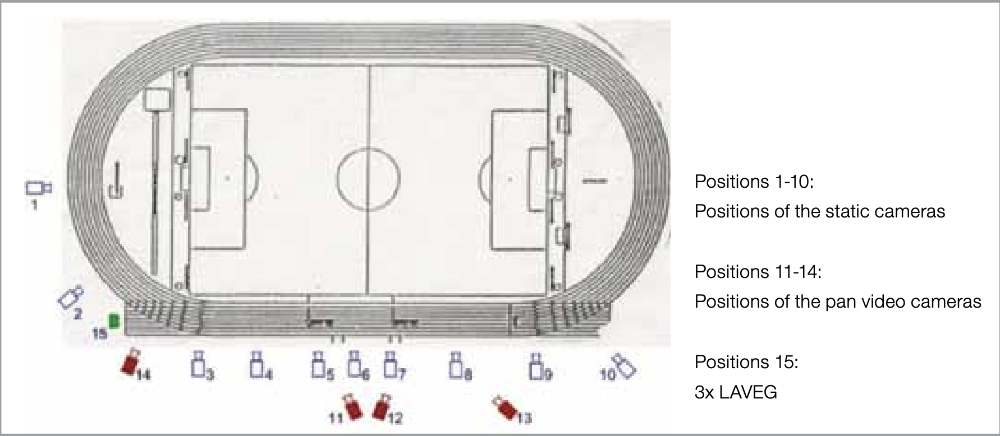
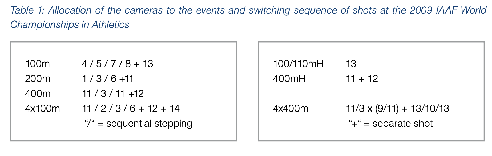

# Extravaganza

Extravaganza is a high performance high throughput biomechanics suite for analysis of human kinematics, dynamics, stabilography, ground reaction forces and posture in the realm of sprint running athletics. 

## Video Partitioning
Video footage is captured in different formats, aspect ratio, daylight/night conditions, weather conditions and the number of cameras used to produce the footage. 
The magnitude of the differences in the footage acquired is best illustrated by simply looking at the camera setup layouts used at two WCA sanctioned events occuring 
at two of the highest rated athletic circuits in the world, the Berlin Olympia Stadion and the Queen Elizabeth II Olympic Stadium.

### Berlin 2009
A team lead by Rolf Graubner and individuals from Martin-Luther University Halle, in Wittenberg, Olympic Training Centre Berlin and JenaOptik 
implemented a setup that included eight orthogonally aligned  static CCTV colour cameras recording at 50Hz, whose positions changed dependent on 
the event and four professional 3CCD cameras exclusively for panning.



Unlike the Olympics, which use the Omega Rectangle system which combines a contact dependent false start detection system, electronic starting pistol 
and a scanning image finish line camera. Instantaneous start mechanism, that is, the timing system being triggered at the exact same time as the pistol 
trigger was pulled, with zero delay, only became a reality in 2012 at the London Olympics. The starting pistol was modified to produce a bright flash 
that instantaneously triggered the timing system at the finish line. In 2009, the start pulse had to travel 800m of electrical cables which gave a negligible 
but non zero delay in triggering the timing system. An external video timer ForA VTG33 was used for synchronization of all cameras and internal camera 
synchronization was carried out using frequency modulation of current in the closed loop cable connecting all cameras. Laser sensors and single cameras 
mounted on rails were only used in the 100m event which allows for easier video recording and for precise measurements. 



### London 2017

Eleven vantage locations for camera placement were identified and secured. Six of these were
dedicated to the home straight and the additional five were strategically positioned around the
stadium (Figure 1). Each of the home straight locations had the capacity to accommodate up to
five cameras placed on tripods in parallel. Five locations were situated on the broadcasting
balcony along the home straight (from the 300 m line to the 390 m line) whilst the sixth location
was located within the IAAF VIP outdoor area overlooking the finish line from a semi-frontal angle.
Two separate calibration procedures were conducted before and after each competition. First, a
series of nine interlinked training hurdles were positioned every 10 m along the home straight
ensuring that the crossbar of each hurdle, covered with black and white tape, was aligned with
the track’s transverse line (Figure 2). These hurdles were also positioned across all nine lanes on
the track markings for the 100, 200 and 300 m intervals. Second, a rigid cuboid calibration frame
was positioned on the running track between the 347-metre mark and the 355.5-metre mark (from
the starting line) multiple times over discrete predefined areas along and across the track to
ensure an accurate definition of a volume within which athletes were achieving high running
speeds (Figure 3). This approach produced a large number of non-coplanar control points per
individual calibrated volume and facilitated the construction of bi-lane specific global coordinate
systems. 


## Open problem - sound lag in video transmission, omega rectangle  start system

- extravaganza
   - config
     - config_reader
   - activity
      - base
      - boxing
      - combo_detection
      - contact_analyzer
      - fencing
      - martial_arts
      - mixed_martial_arts
      - ml_intergration
      - pixel_change_detector
      - visualization
   - biomechanics
       - dynamics_analyzer
       - grf_analyzer
       - kinematics_analyzer
       - posture_converter
       - stability_analyzer
       - sync_analyzer
   - core 
       - athlete_detection
       - human_detector
       - movement_tracker
       - pose_detector
       - scene_detector
       - skeleton
   - motion 
       - motion_classifier
   - pipeline
       - biomechanics_analysis
       - motion_analysis
       - scene_analysis
   - stabilography
       - movement_detector
       - stabilography
   - utils 
       - camera_calibrator
       - lane_detector
       - video_frame_manager
       - video_quality
       - video_reader
       - video_reconstructor

# Golf Swing Analysis Pipeline Documentation

## Overview
The golf swing analysis system consists of several key components working together to analyze golf swings from video input. The pipeline integrates pose estimation, club tracking, and phase detection to provide comprehensive swing analytics.

## Core Components

### 1. Pose Detection
- **Algorithm**: MediaPipe Pose
- **Purpose**: Extracts 33 body landmarks in 3D space
- **Key Features**:
  - Real-time pose detection
  - Confidence scoring for each keypoint
  - 3D coordinate estimation
- **Implementation Details**:
  - Minimum detection confidence: 0.7
  - Minimum tracking confidence: 0.5
  - Frame-by-frame pose extraction

### 2. Club Tracking
- **Algorithm**: Optical Flow + CSRT Tracker
- **Purpose**: Tracks club head position throughout swing
- **Process Flow**:
  1. Initial club head detection using template matching
  2. Tracking maintenance using CSRT algorithm
  3. Path smoothing using Kalman filter
- **Parameters**:
  - Quality level: 0.3
  - Min distance between points: 7
  - Max points tracked: 200

### 3. Swing Phase Detection
- **Method**: Pose-based angle analysis
- **Phases Detected**:
  1. Setup
  2. Takeaway
  3. Backswing
  4. Top of swing
  5. Downswing
  6. Impact
  7. Follow-through
- **Detection Criteria**:
  - Angular thresholds for key joints
  - Temporal sequence validation
  - Smoothing window: 5 frames

## Data Flow

```mermaid
graph TD
    A[Video Input] --> B[Frame Extraction]
    B --> C[Pose Detection]
    B --> D[Club Tracking]
    C --> E[Phase Detection]
    D --> E
    E --> F[Metrics Calculation]
    F --> G[Results Generation]
